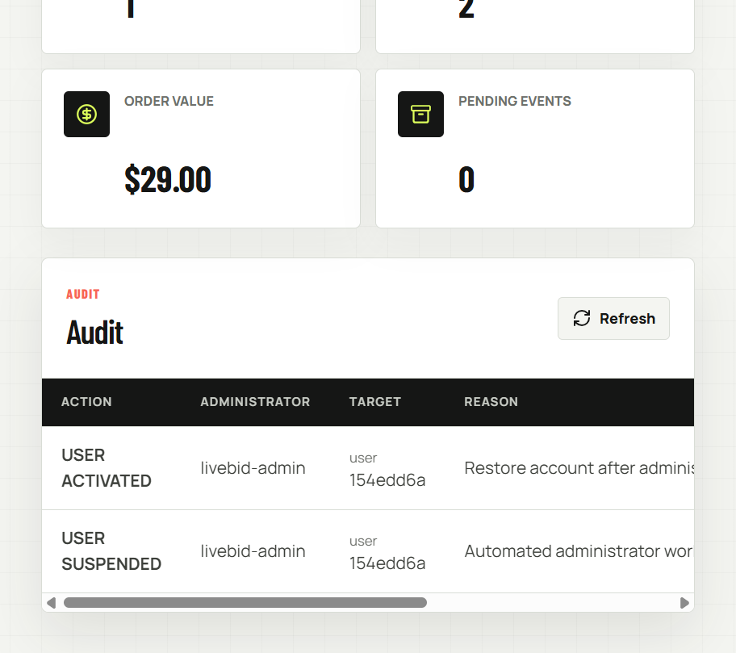
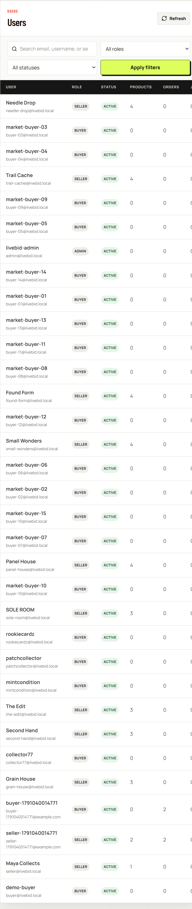
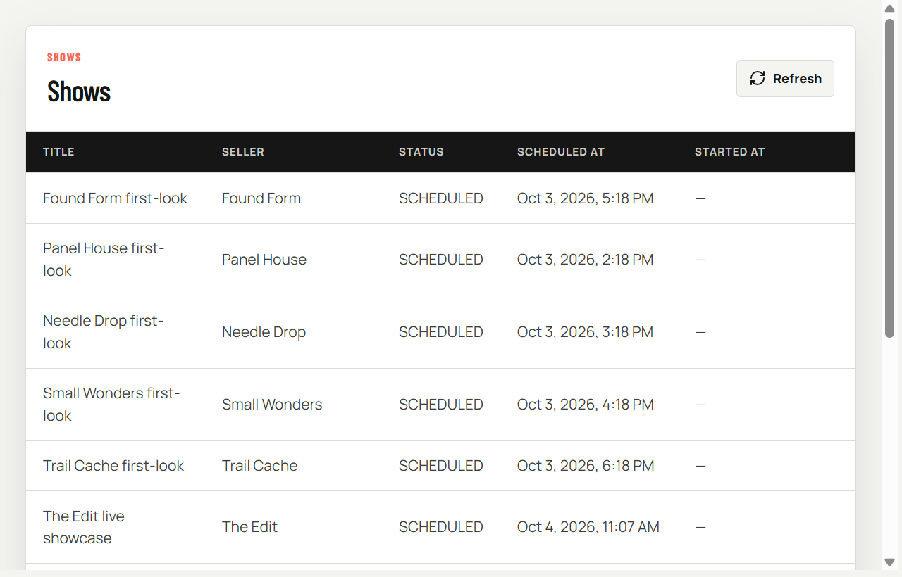
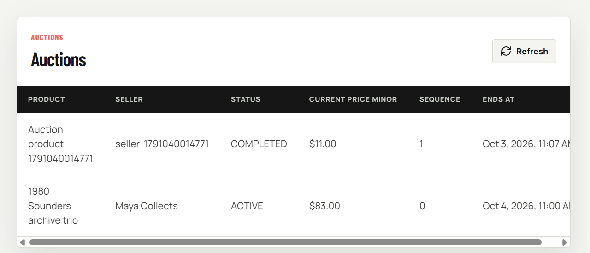
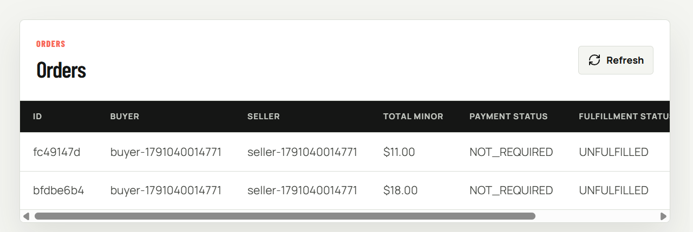
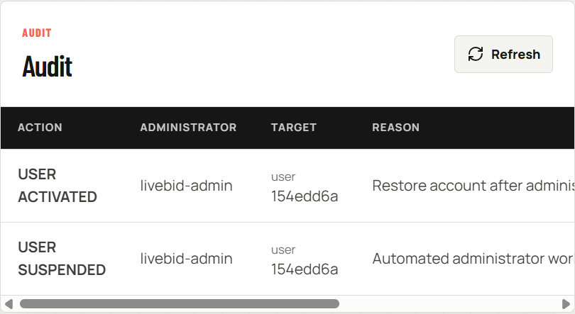
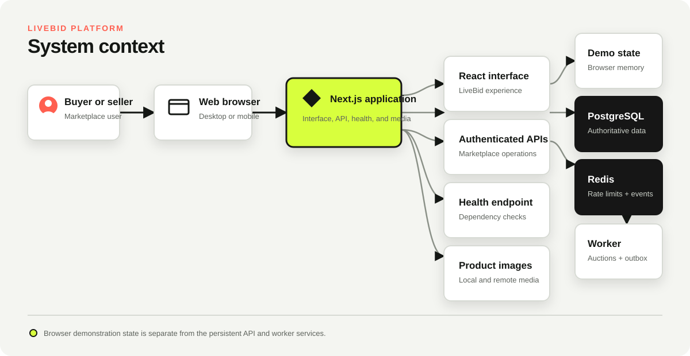

## LiveBid: Live Commerce Marketplace

LiveBid is a mobile-first live-commerce marketplace prototype. It combines a
responsive buyer and seller experience with authenticated APIs, PostgreSQL,
Redis, an auction worker, health checks, and Docker Compose deployment.


## Start here

Choose the path that matches what you want to do.

| Goal | Best starting point | Time |
|------|---------------------|------|
| Run the complete solution locally | [Docker quickstart](docs/docker-quickstart.md) | 5 minutes |
| Learn the buyer and seller experience | [End-user guide](docs/user-guide.md) | 10 minutes |
| Operate users, catalog, shows, and auctions | [Administrator guide](docs/admin-guide.md) | 10 minutes |
| Understand the system | [Architecture guide](docs/architecture.md) | 15 minutes |
| Review implementation details | [Technical design](docs/technical-design.md) | 25 minutes |
| Deploy a production container stack | [Deployment guide](docs/deployment.md) | 20 minutes |
| Ask GitHub Copilot to deploy it | [Copilot deployment specification](docs/copilot-deployment-spec.md) | 20 minutes |

## Run the complete solution with Docker

You need [Git](https://git-scm.com/) and
[Docker Desktop](https://www.docker.com/products/docker-desktop/) or Docker
Engine with the Compose plugin.

```bash
git clone https://github.com/KrishnaDistributedcomputing/livebid.git
cd livebid
docker compose up --detach --build --wait
docker compose ps
```

Open these local URLs:

| Service | URL |
|---------|-----|
| Marketplace | <http://localhost:3001> |
| Administrator portal | <http://localhost:3001/admin> |
| Health check | <http://localhost:3001/api/health> |

Verify the deployment:

```bash
curl --fail http://localhost:3001/api/health
docker compose logs --tail 50 livebid worker
```

The stack starts four services:

* `livebid` serves the Next.js interface and API
* `worker` processes auction lifecycle and outbox jobs
* `postgres` stores authoritative marketplace data
* `redis` supports rate limiting and event publication

See the [Docker quickstart](docs/docker-quickstart.md) to load demonstration
data, sign in as an administrator, update the containers, change ports,
troubleshoot startup, and remove local volumes safely.

## Load demonstration data

The idempotent seed creates one administrator, ten sellers, twenty buyers,
thirty-three products, shows, an active auction, and sample chat. Run it only
in a local or disposable environment:

```bash
docker compose exec \
  -e SEED_PASSWORD=LiveBidDemoPassword123 \
  livebid node scripts/seed.mjs
```

Sign in at <http://localhost:3001/admin>:

```text
Email: admin@livebid.local
Password: LiveBidDemoPassword123
```

> [!WARNING]
> Never seed a production environment. Replace demonstration credentials
> before sharing any deployment.

## See the product

### Buyer and seller experience

| Live auction and chat | Show discovery |
|-----------------------|----------------|
|  |  |

| Marketplace catalog | Order tracking |
|---------------------|----------------|
|  |  |

| Seller overview | Show readiness |
|-----------------|----------------|
|  |  |

### Administrator operations

| Operations overview | User management |
|---------------------|-----------------|
|  |  |

| Show schedule | Auction monitoring |
|---------------|--------------------|
|  |  |

| Order operations | Audit history |
|------------------|---------------|
|  |  |

The [end-user guide](docs/user-guide.md) includes discovery, auction,
marketplace, order, and studio screenshots. The
[administrator guide](docs/admin-guide.md) covers authentication, account
controls, resource monitoring, and audit records.

## Understand the architecture



The visual marketplace currently keeps its demonstration interactions in the
browser. The API independently persists accounts, products, shows, auctions,
bids, chat, and orders. The administrator portal uses the authenticated admin
API.

> [!IMPORTANT]
> Payment capture, shipping labels, and live video streaming are not included.
> Do not use this release for real financial transactions.

## Technology

| Layer | Implementation |
|-------|----------------|
| Application | Next.js 15 App Router |
| User interface | React 19.1 and TypeScript |
| Database | PostgreSQL 17 |
| Cache and events | Redis 7.4 |
| Authentication | Password hashing and HTTP-only sessions |
| Worker | Node.js auction and outbox processor |
| Container | Node.js 24 Alpine and standalone Next.js |
| Orchestration | Docker Compose |
| Health check | `GET /api/health` |

## Deploy the production stack

Production deployment uses a published image, private database and Redis
networks, required secrets, persistent volumes, and a public HTTPS origin.

```bash
git clone https://github.com/KrishnaDistributedcomputing/livebid.git
cd livebid
cp .env.production.example .env
chmod 600 .env
```

Replace every placeholder in `.env`, then validate and start the stack:

```bash
docker compose --env-file .env -f compose.production.yaml config --quiet
docker compose --env-file .env -f compose.production.yaml pull
docker compose --env-file .env -f compose.production.yaml up --detach --wait
docker compose --env-file .env -f compose.production.yaml ps
curl --fail http://127.0.0.1:3001/api/health
```

Use an immutable `LIVEBID_IMAGE` tag for repeatable releases and put an HTTPS
reverse proxy in front of port `3001`. Follow the
[deployment guide](docs/deployment.md) for secret generation, GHCR publishing,
Linux deployment, TLS, updates, backups, rollback, and Azure Container Apps.

## Develop from source

Install [Node.js 20 or newer](https://nodejs.org/) and pnpm `10.18.3`.

```bash
npm install --global pnpm@10.18.3
pnpm install --frozen-lockfile
pnpm dev
```

Open <http://localhost:3000>. The interface can run without backend
dependencies, but PostgreSQL and Redis are required for healthy API responses.
Use Docker Compose when you need the complete stack.

Run the project checks before contributing:

```bash
pnpm lint
pnpm build
docker compose config --quiet
```

## Repository map

```text
livebid/
|-- .github/workflows/       Container build and GHCR publishing
|-- db/migrations/           Versioned PostgreSQL schema
|-- docs/                    Product, architecture, and deployment guides
|-- public/                  Static product media
|-- scripts/                 Migration, seed, and worker processes
|-- src/
|   |-- app/                 Next.js pages and API routes
|   |-- components/          Marketplace and administrator interfaces
|   `-- lib/                 Database, Redis, authentication, and auctions
|-- compose.yaml             Local four-service stack
|-- compose.production.yaml  Published-image production stack
|-- Dockerfile               Multi-stage non-root production image
`-- package.json             Development and validation commands
```

## Common Docker commands

```bash
# View service state
docker compose ps

# Follow application and worker logs
docker compose logs --follow livebid worker

# Rebuild after a source change
docker compose up --detach --build --wait

# Stop the stack and preserve data
docker compose down

# Remove the stack and all local database data
docker compose down --volumes
```

> [!CAUTION]
> `docker compose down --volumes` permanently deletes the local PostgreSQL and
> Redis data volumes.

## Get help

Start with the [Docker troubleshooting guide](docs/docker-quickstart.md#troubleshooting)
for local startup issues. Use the production
[verification checklist](docs/deployment.md#verify-any-deployment) and
[rollback procedure](docs/deployment.md#roll-back-a-container-deployment) for
shared environments.
