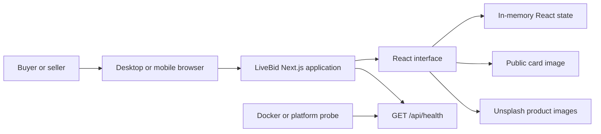
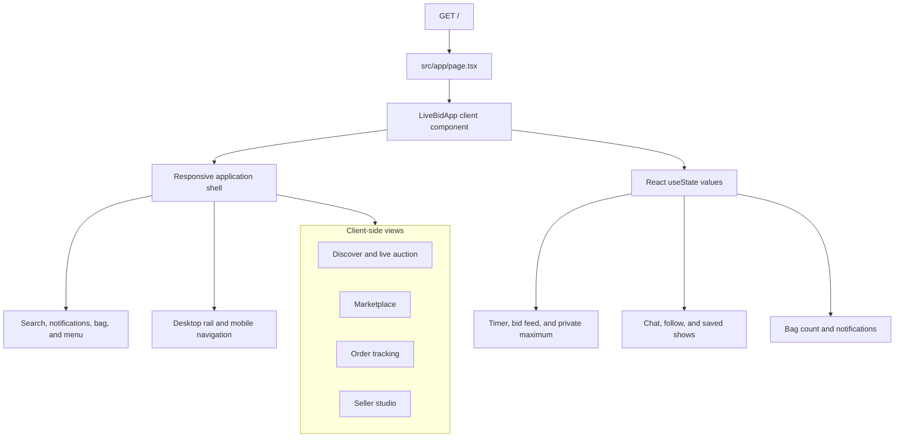
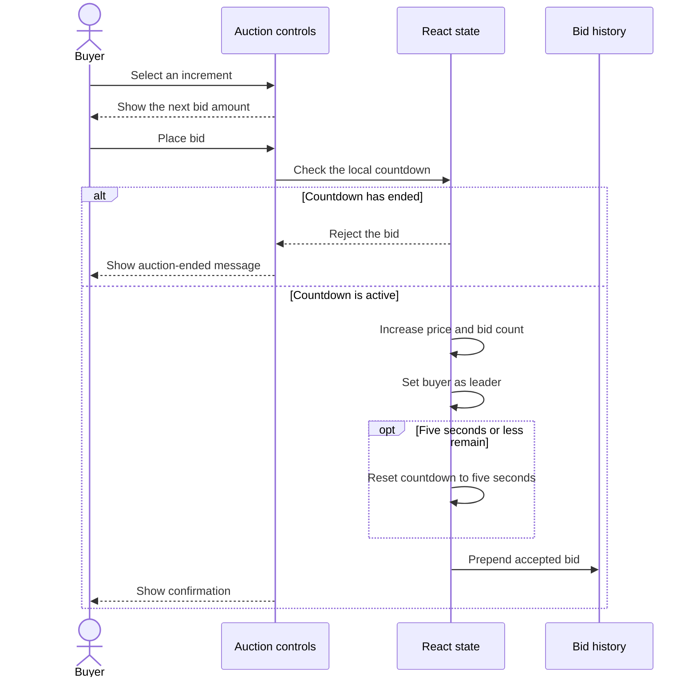
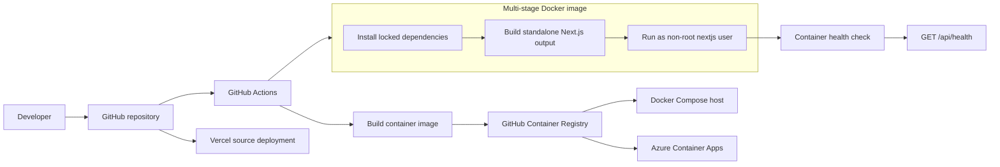
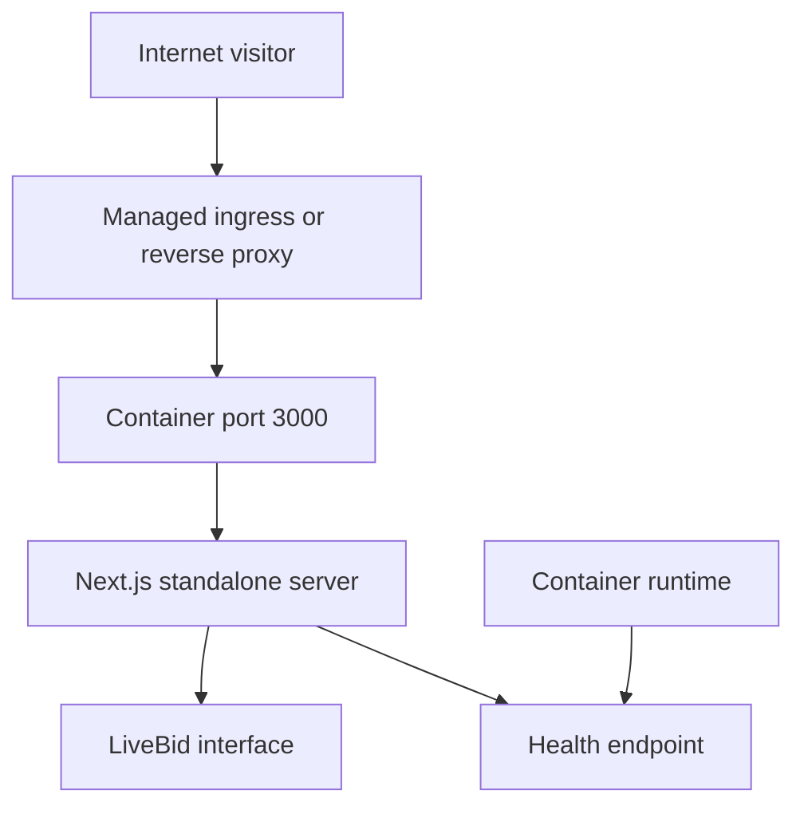
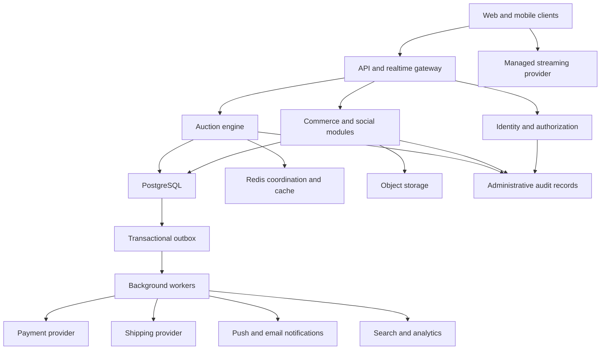
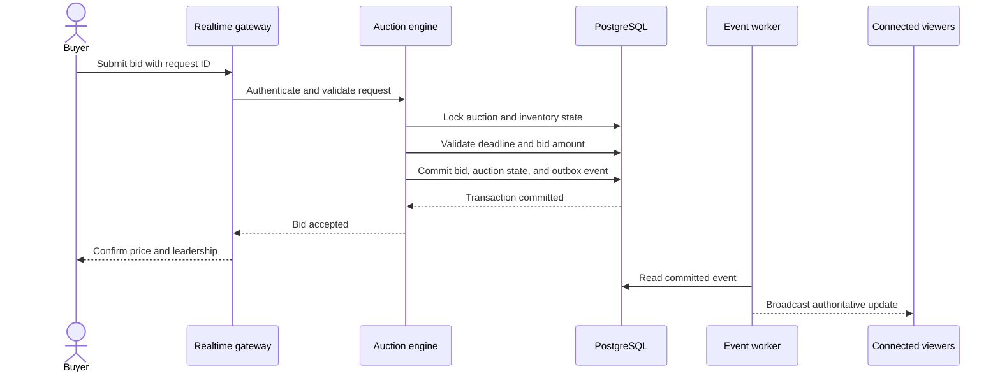

## Architecture scope

LiveBid currently runs as a single Next.js web application. It demonstrates
buyer and seller journeys with browser-held sample state. The repository does
not yet contain the persistent commerce services described in the product
roadmap.

This guide separates two architectural states:

* The implemented prototype, which can be run and deployed today
* The planned marketplace, which is a target design rather than deployed code

> [!IMPORTANT]
> Bids, chat messages, follows, reminders, cart counts, and other interactions
> are not sent to a backend or saved. Reloading the page resets the experience.

## Current system context

The deployed application has one user-facing process. The browser downloads
the application, React manages the interactive state, and Next.js serves a
health endpoint for deployment probes.

No authentication provider, database, cache, payment processor, shipping
provider, or streaming service participates in this runtime.

## Current application components

The App Router renders one client application. Navigation changes the visible
view without creating additional URL routes.

The main implementation boundaries are:

| Boundary                    | Responsibility                                                   |
|-----------------------------|------------------------------------------------------------------|
| `src/app/layout.tsx`        | Global metadata, fonts, styles, and document shell               |
| `src/app/page.tsx`          | Root page composition                                            |
| `src/components/livebid-app.tsx` | Views, sample data, interactions, and browser-held state    |
| `src/app/globals.css`       | Responsive visual system and component styling                   |
| `src/app/api/health/route.ts` | Dynamic JSON health response used by deployment probes         |
| `public/`                   | Local static media                                               |

## Prototype bid sequence

Bid acceptance is a local user-interface simulation. It demonstrates feedback
and anti-sniping behavior, but it does not provide concurrency control or
durability.

The private maximum form validates that the amount is at least the next bid.
It stores the value locally and does not perform automatic proxy bidding.

## Build and delivery architecture

The same source can run through the Next.js development server, as a
standalone Node.js process, or in the production container.

Pull requests build the image without publishing it. Pushes to `main` and
version tags publish images to GitHub Container Registry. The runtime image
contains the standalone server, static build assets, and public media.

## Deployment topology

The container listens on port `3000`. Docker Compose maps host port `3001` by
default, while managed platforms can expose the container through their own
HTTPS ingress.

For local development, the browser connects directly to
`http://localhost:3000`. For the default local Compose workflow, it connects
to `http://localhost:3001`.

## Planned marketplace architecture

The product roadmap starts with a modular monolith and server-authoritative
auction processing. Services should be extracted only when scaling or
operational isolation requires it.

The database remains authoritative for bids, auctions, inventory, orders, and
outbox events. Redis can coordinate realtime work and cache reads, but it
cannot replace a durable transaction for bid acceptance.

## Planned auction transaction boundary

The server must acknowledge a bid only after durable auction state, bid
history, and the event to be published are committed together.

Idempotency keys, deterministic tie handling, authorization checks, and
server-owned deadlines are required before the auction flow can process real
transactions.

## Evolution path

| Phase                    | Architecture change                                                  |
|--------------------------|----------------------------------------------------------------------|
| Interactive prototype    | Single Next.js process with browser-held state                        |
| Persisted MVP            | Add API modules, identity, PostgreSQL, and server-side authorization  |
| Realtime commerce        | Add auction coordination, WebSockets, Redis, and transactional outbox |
| Transactional marketplace | Integrate payments, inventory reservations, shipping, and audit     |
| Scaled platform          | Extract auction, streaming, and worker services as load requires      |

Keep the phase boundaries explicit. A user-interface demonstration should not
be presented as durable commerce behavior until the required server-side
components and failure handling are implemented and tested.

## Related guides

* Follow the [user guide](user-guide.md) to exercise the implemented journeys
* Follow the [deployment guide](deployment.md) to run or publish the application
* Return to the [repository overview](../README.md) for prerequisites and
  source commands
