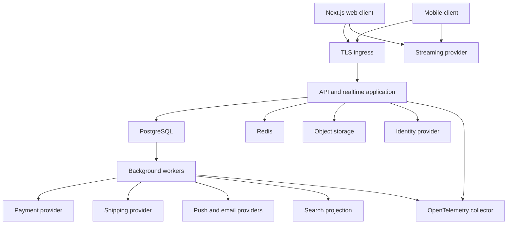
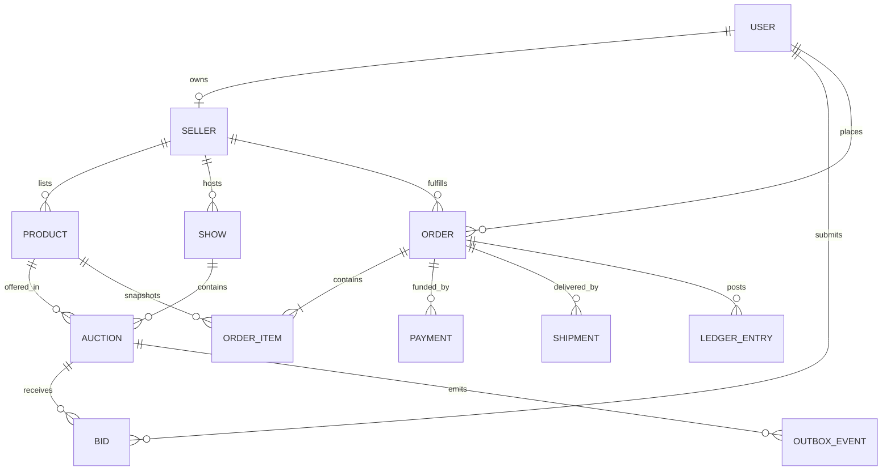
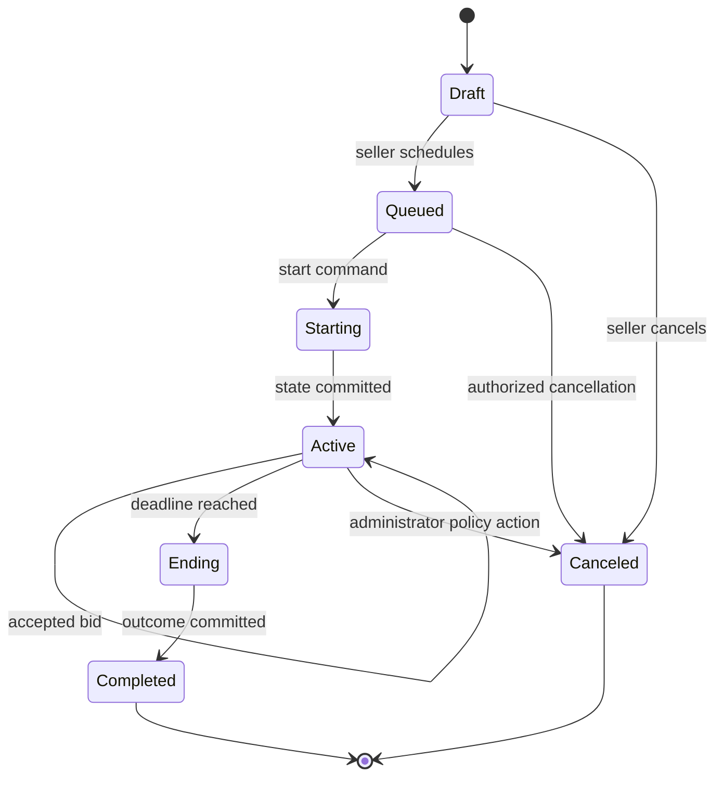
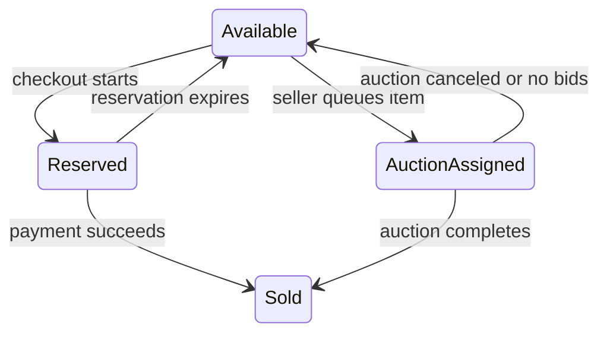
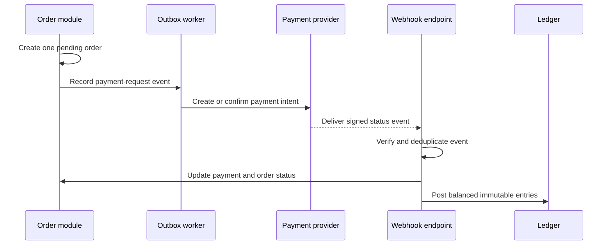

## Document status

| Field          | Value                                                     |
|----------------|-----------------------------------------------------------|
| Status         | Proposed                                                  |
| Target         | Persistent marketplace MVP                                |
| Current system | Browser-only Next.js prototype                            |
| Primary stack  | TypeScript, Next.js, PostgreSQL, Redis, and WebSockets     |
| Deployment     | Container-based managed platform                          |

This design defines the implementation target for converting the current
interactive prototype into a transactional live-commerce marketplace. It is
not a description of functionality already present in the repository.

> [!IMPORTANT]
> The existing application stores demo state in the browser. Every backend,
> database, realtime, payment, shipping, and moderation component in this
> design must be implemented and validated before LiveBid handles real users,
> bids, purchases, or seller proceeds.

## Goals

The MVP must support these outcomes:

* Buyers can discover shows, join a live room, chat, bid, purchase fixed-price
  inventory, and track orders
* Sellers can complete onboarding, manage products, schedule shows, conduct
  auctions, fulfill orders, and review defined performance metrics
* Administrators can moderate users and content, investigate transactions,
  manage disputes, and audit privileged actions
* Auction results remain deterministic during concurrency, retries, restarts,
  reconnects, and cache loss
* Inventory, orders, payments, shipments, fees, and seller proceeds maintain
  traceable financial records
* Deployments are observable, reversible, and isolated by environment

## Non-goals

The first persistent release excludes:

* Multi-region active-active writes
* Multi-currency settlement
* Advertising and influencer programs
* Rewards, seller tiers, and advanced recommendations
* AI-generated listings and AI moderation decisions
* Offers and giveaways
* Service-per-module microservice deployment

These exclusions reduce the number of consistency boundaries and operational
dependencies in the MVP.

## Design principles

1. PostgreSQL is authoritative for commercial state.
2. The server owns auction deadlines, ordering, and winner selection.
3. Every externally retried mutation has an idempotency contract.
4. Financial movements use immutable ledger entries.
5. Private values never enter public events, logs, or analytics.
6. Asynchronous work originates from a transactional outbox.
7. Authorization is enforced inside the application boundary, not only in the
   user interface.
8. The modular monolith is the default deployment until measured load requires
   extraction.

## Quality attributes

Initial service-level objectives must be confirmed through capacity testing.
The proposed starting targets are:

| Attribute                    | Proposed MVP target                                      |
|------------------------------|----------------------------------------------------------|
| API availability             | 99.9% monthly, excluding announced maintenance           |
| Bid acceptance latency       | p95 below 250 ms and p99 below 500 ms                    |
| Realtime update latency      | p95 below 500 ms after transaction commit                |
| Read API latency             | p95 below 300 ms                                         |
| Recovery point objective     | Five minutes or less for primary transactional data      |
| Recovery time objective      | One hour or less                                         |
| Duplicate commercial effects | Zero duplicate orders, charges, labels, or ledger entries |
| Auction correctness          | Exactly one deterministic final outcome                  |

Error budgets must be measured per environment. Video latency is tracked
separately and never changes the authoritative auction deadline.

## System topology

The MVP uses a modular API deployment, background workers, managed data
services, and external providers.



The API and workers share module contracts and database schemas. They can be
packaged from one monorepo while running as separate processes.

## Repository target

The implementation should evolve toward this structure without requiring all
directories in the first change:

```text
livebid/
|-- apps/
|   |-- web/                 Buyer and seller web application
|   |-- admin/               Administrative interface
|   `-- api/                 HTTP and realtime entry points
|-- packages/
|   |-- auth/                Identity and authorization policies
|   |-- database/            Schema, migrations, and repositories
|   |-- domain/              Entities, value objects, and invariants
|   |-- events/              Event contracts and outbox support
|   |-- observability/       Logging, metrics, and tracing
|   `-- ui/                  Shared user-interface components
|-- workers/
|   |-- payments/            Payment commands and webhooks
|   |-- shipping/            Labels and tracking updates
|   `-- notifications/       Push and email delivery
|-- infrastructure/          Deployment and managed-service definitions
`-- docs/                    Architecture, design, operations, and user guides
```

Use workspace boundaries to prevent the user interface from importing database
or provider implementations directly.

## Module boundaries

| Module          | Owns                                                               |
|-----------------|--------------------------------------------------------------------|
| Identity        | User identity mapping, sessions, roles, and account status         |
| Sellers         | Seller profile, verification status, and provider account mapping  |
| Catalog         | Products, categories, media, condition, and availability           |
| Shows           | Schedule, room membership, stream references, and moderation roles |
| Auctions        | Lifecycle, deadlines, increments, bids, maxima, and outcomes       |
| Checkout        | Fixed-price reservation and purchase orchestration                 |
| Orders          | Order snapshots, totals, status, and buyer or seller views         |
| Payments        | Provider intents, webhooks, refunds, fees, and ledger postings      |
| Shipping        | Rates, labels, tracking, bundling, and delivery status              |
| Social          | Follows, chat, reminders, and notifications                        |
| Trust           | Reports, moderation, disputes, enforcement, and audit events       |
| Analytics       | Defined metrics and read-optimized reporting projections           |

Modules communicate through typed commands, queries, and domain events.
Direct cross-module table writes are prohibited. A module can read another
module through an application service or an explicitly maintained projection.

## Identity and authorization

An external OpenID Connect provider authenticates users. LiveBid stores the
provider subject, platform profile, roles, and account status.

### Roles

| Role          | Selected permissions                                               |
|---------------|--------------------------------------------------------------------|
| Buyer         | Join rooms, chat, bid, purchase, follow, report, and manage orders |
| Seller        | Manage own catalog, shows, auctions, fulfillment, and moderators   |
| Moderator     | Moderate only assigned shows                                       |
| Support       | Review assigned reports, orders, and disputes                      |
| Administrator | Manage policy, enforcement, fee rules, and privileged operations   |

Authorization evaluates user role, resource ownership, assignment, account
status, and action-specific eligibility. Seller status does not permit access
to another seller's inventory or shows. A seller cannot bid on their own item.

Privileged changes create an `AuditEvent` containing actor, action, resource,
reason, timestamp, request ID, and redacted before-and-after values.

## Data design

Use UUIDv7 or another sortable, globally unique identifier strategy. Store
money in integer minor units with an ISO 4217 currency code. Store timestamps
in UTC using `timestamptz`.



### Principal records

| Record          | Required fields                                                        |
|-----------------|------------------------------------------------------------------------|
| User            | ID, provider subject, username, roles, status, and timestamps           |
| Seller          | ID, user ID, display name, verification, payment account, and rating    |
| Product         | ID, seller ID, title, condition, currency, prices, quantity, and status |
| Show            | ID, seller ID, schedule, stream ID, status, and timestamps              |
| Auction         | ID, show ID, product ID, type, prices, deadline, leader, version, status |
| Bid             | ID, auction ID, buyer ID, amount, sequence, request key, and timestamp   |
| Order           | ID, parties, monetary totals, applied fee rule, and status values       |
| OrderItem       | Order ID, product ID, title snapshot, quantity, and unit price           |
| Payment         | Order ID, provider reference, amount, request key, and status            |
| Shipment        | Order ID, carrier, service, label reference, tracking, and status        |
| LedgerEntry     | Account, direction, amount, currency, source, and immutable timestamp    |
| OutboxEvent     | Aggregate, event type, payload, sequence, attempts, and publish status   |

### Constraints and indexes

The schema must include:

* Unique user identity-provider subjects and normalized usernames
* Unique bid idempotency keys scoped to buyer and auction
* Unique bid sequence within an auction
* Unique winning order per auction
* Unique active inventory reservation per product unit
* Unique provider event ID for every webhook source
* Unique payment action key and shipping-label request key
* Check constraints for non-negative monetary amounts and quantities
* Foreign keys for every aggregate relationship
* Partial indexes for active auctions, unpublished outbox events, and pending
  provider operations

Private maximum bids should be encrypted at the application layer or stored in
a separately permissioned table. Public bid projections contain only the
effective bid amount and approved bidder display identity.

## Auction state model



Only `Active` auctions accept bids. The `Ending` transition acquires the same
serialization boundary as bid acceptance, which prevents a deadline race from
creating two outcomes.

### Bid invariants

* The server clock determines whether the deadline has passed
* Each accepted bid receives one strictly increasing auction sequence
* The current price, leader, deadline, and version change atomically
* Equal proxy maxima are resolved by earliest accepted maximum
* Private maxima never appear in public responses or events
* Anti-sniping extends to at least the configured interval after acceptance
* Sudden-death auctions never extend
* Auction closure creates at most one winner and one order
* Retrying a request returns its original result

### Bid transaction

```text
begin transaction
  load auction for update
  load existing result by buyer and idempotency key
  return existing result when present

  verify buyer eligibility, auction ownership, status, and server deadline
  calculate the effective bid using increment and proxy rules
  reject invalid currency, amount, or eligibility

  insert immutable bid with next sequence
  update auction price, leader, deadline, version, and sequence
  insert public auction event into outbox
  insert private notification events where required
commit transaction

return the committed public auction snapshot
```

The API must not broadcast or acknowledge acceptance before the transaction
commits. A serialization failure retries the entire calculation against the
newest state with a bounded retry count.

## Proxy bidding

For a direct bid, the submitted amount must equal or exceed the next valid
amount. For a proxy bid, the buyer supplies a private maximum.

Given the two highest eligible maxima:

1. The greater maximum leads.
2. The public price is the lesser maximum plus the configured increment.
3. The public price cannot exceed the leading maximum.
4. Equal maxima preserve the earliest accepted maximum as leader.
5. A new maximum can be accepted while immediately reporting the buyer as
   outbid by an existing higher maximum.

Store every maximum revision as an immutable private record. Do not overwrite
history that may be needed for disputes.

## Inventory consistency

Inventory uses explicit states:



A product unit cannot be reserved for checkout and assigned to an active
auction simultaneously. Quantity changes use a conditional update or row lock.
Reservation expiry is processed by a worker using the database clock.

## HTTP API conventions

All APIs are versioned under `/v1`. JSON uses camel case. Dates use RFC 3339
UTC strings. Monetary values use `{ amountMinor, currency }`.

### Headers

| Header             | Use                                                      |
|--------------------|----------------------------------------------------------|
| `Authorization`    | Bearer access token                                      |
| `Idempotency-Key`  | Required for commercial mutations                        |
| `X-Request-ID`     | Client request correlation, generated when absent        |
| `If-Match`         | Optional optimistic concurrency for editable resources   |

### Error envelope

```json
{
  "error": {
    "code": "AUCTION_EXPIRED",
    "message": "The auction is no longer accepting bids.",
    "requestId": "req_01K...",
    "details": {}
  }
}
```

Error codes are stable programmatic contracts. Messages can change and must
not contain internal exceptions, provider secrets, or private bid values.

### Principal endpoints

| Method | Path                                  | Purpose                           |
|--------|---------------------------------------|-----------------------------------|
| GET    | `/v1/shows`                           | Discover scheduled and live shows |
| GET    | `/v1/shows/{showId}`                  | Load the room snapshot             |
| POST   | `/v1/shows/{showId}/join`             | Authorize realtime membership      |
| POST   | `/v1/auctions/{auctionId}/bids`       | Submit a direct or proxy bid       |
| GET    | `/v1/auctions/{auctionId}`            | Recover authoritative state        |
| POST   | `/v1/products/{productId}/reserve`    | Begin fixed-price checkout         |
| POST   | `/v1/orders`                          | Create an order from a reservation |
| GET    | `/v1/orders/{orderId}`                | Load an authorized order view      |
| POST   | `/v1/orders/{orderId}/shipping-label` | Request an idempotent label         |
| POST   | `/v1/reports`                         | Submit a trust and safety report   |

Collection endpoints use opaque cursors and a bounded page size. Resource
responses include only fields allowed for the authenticated role.

### Bid request

```http
POST /v1/auctions/auc_123/bids
Authorization: Bearer <token>
Idempotency-Key: 0199f8c7-98f0-7d00-a9ae-115263fc8c42
Content-Type: application/json
```

```json
{
  "maxBidMinor": 10000,
  "currency": "USD"
}
```

```json
{
  "accepted": true,
  "auctionId": "auc_123",
  "currentPriceMinor": 5600,
  "currency": "USD",
  "leader": {
    "displayName": "collector77"
  },
  "deadline": "2026-10-03T15:00:05.000Z",
  "remainingMs": 18342,
  "sequence": 232,
  "version": 232
}
```

The response intentionally excludes every bidder's private maximum.

## Realtime protocol

WebSocket connections authenticate during setup and authorize each show
subscription. A short-lived room token can carry the user ID, show ID, role,
and expiration.

### Event envelope

```json
{
  "event": "auction.bid",
  "eventId": "evt_01K...",
  "aggregateId": "auc_123",
  "sequence": 233,
  "occurredAt": "2026-10-03T15:00:01.227Z",
  "data": {
    "priceMinor": 7500,
    "currency": "USD",
    "leader": {
      "displayName": "collector77"
    },
    "deadline": "2026-10-03T15:00:06.227Z"
  }
}
```

Clients deduplicate by `eventId`, apply auction events by sequence, and request
an HTTP snapshot after a sequence gap or reconnect. The gateway never invents
auction state. It broadcasts committed outbox events.

### Event groups

| Group        | Events                                                               |
|--------------|----------------------------------------------------------------------|
| Show         | `show.started`, `show.ended`, `viewer.count`                          |
| Auction      | `auction.started`, `auction.bid`, `auction.extended`, `auction.ended` |
| Buyer        | `auction.outbid`, `order.updated`, `payment.updated`                  |
| Chat         | `chat.message`, `chat.removed`, `participant.muted`                   |
| Inventory    | `product.queued`, `product.sold`, `product.unavailable`               |

Private events use user-specific channels. Public room events must not include
email, legal identity, payment eligibility, private maxima, addresses, or
moderation evidence.

## Transactional outbox

Every domain transaction that requires asynchronous work inserts an
`OutboxEvent` in the same database commit. Workers claim events with
`FOR UPDATE SKIP LOCKED`, record attempt counts, and apply exponential backoff.

Consumers are idempotent because delivery is at least once. A dead-letter state
captures events that exceed the retry policy and raises an operational alert.
Operators can replay an event after correcting its cause without editing the
original payload.

## Payment design

Use Stripe Connect or an equivalent marketplace-capable provider. Provider
selection, account model, and fund flow require legal and finance approval.



Never store raw card data. Webhooks require signature verification, provider
event deduplication, timestamp tolerance, and raw-body validation. Client-side
success does not establish payment success.

Ledger entries must balance for every transaction. Separate sale value,
shipping, tax, platform fee, processing fee, seller proceeds, refunds,
chargebacks, reserves, and payouts.

## Shipping design

The shipping module integrates with one provider behind an internal adapter.
Label requests use an idempotency key derived from order, package revision, and
service selection.

Tracking webhooks are verified and deduplicated. Status transitions cannot
move backward unless the provider reports a documented exception. Store the
provider payload needed for support in a restricted retention tier.

The first release should support one origin country, explicit carriers, and
documented package limits.

## Chat and moderation

The chat write path performs:

1. Authentication and room-membership authorization
2. Account and show moderation-state checks
3. Per-user and per-room rate limiting
4. Length, encoding, spam, and prohibited-link validation
5. Policy classification where enabled
6. Durable message or moderation-event recording
7. Realtime publication

Seller moderators can act only inside assigned shows. Administrators can
perform platform-wide actions. Mutes, removals, blocks, and report decisions
create audit events.

## Security and privacy

### Threat controls

| Risk                         | Required controls                                                   |
|------------------------------|---------------------------------------------------------------------|
| Account takeover             | Provider MFA support, session rotation, anomaly detection           |
| Broken object authorization  | Resource policy checks in every command and query                    |
| Bid manipulation             | Server clock, row locking, immutable history, and signed identity    |
| Replay or duplicate request  | Idempotency keys, expiry windows, and stored original outcomes       |
| Webhook forgery              | Signature validation, timestamp checks, and event deduplication      |
| Overselling                  | Atomic inventory reservation and unique constraints                  |
| Secret disclosure            | Managed secret store, log redaction, and least-privilege identities  |
| Abuse and scraping           | Layered rate limits, bot signals, and endpoint-specific quotas       |
| Data exposure                | Field allowlists, encryption, retention, and access auditing         |

Use TLS for all network traffic. Encrypt managed disks, object storage, and
backups. Database credentials use workload identity where available and rotate
automatically otherwise.

### Sensitive data

Classify and protect:

* Legal identity and seller verification evidence
* Buyer and seller addresses
* Provider customer, account, payment, and payout references
* Private maximum bids
* Dispute evidence and moderation records
* Session, password-reset, and room tokens

Logs, traces, metrics, public events, and analytics exports must exclude these
values. Define retention and deletion rules before production.

## Caching and Redis

Redis can store:

* Rate-limit counters
* Short-lived room authorization and presence
* Auction snapshots for reads after durable commits
* Distributed coordination with fencing tokens where necessary
* Idempotent notification suppression keys

Cache loss must not lose accepted bids or change auction outcomes. Cache writes
occur after the database commit, normally through outbox consumers. Every
cached auction snapshot carries its database version.

## Observability

Propagate one request or trace ID through HTTP, WebSocket commands, database
transactions, outbox events, workers, and provider calls.

### Logs

Use structured JSON logs with service, environment, version, trace ID, user ID
hash, action, aggregate ID, result, error code, and duration. Do not log access
tokens, addresses, private maxima, full provider payloads, or payment details.

### Metrics

At minimum, record:

* Bid attempts, acceptances, rejections, conflicts, and latency
* Auction deadline drift and completion lag
* Active connections, reconnects, sequence gaps, and broadcast latency
* Database saturation, lock wait, transaction retries, and replication lag
* Outbox backlog, delivery attempts, dead letters, and oldest event age
* Payment and shipping provider latency, failures, and webhook lag
* Order, payment, shipment, refund, and dispute state counts

### Alerts

Page operators for auction completion failures, sustained bid latency, payment
webhook failure, database unavailability, or possible duplicate financial
effects. Ticket lower-urgency capacity and backlog trends.

## Failure handling

| Failure                         | Expected behavior                                                |
|---------------------------------|------------------------------------------------------------------|
| Redis unavailable               | Continue durable paths, reduce optional features, rebuild cache  |
| Realtime gateway restart        | Clients reconnect and recover snapshots plus missing sequences   |
| Worker restart                  | Leases expire and another worker retries idempotently             |
| Payment provider timeout        | Preserve pending state and reconcile before retrying              |
| Shipping provider timeout       | Query by idempotency key before requesting another label          |
| Database failover               | Reject unsafe writes, reconnect, and resume from durable state     |
| Deployment regression           | Stop rollout and redeploy the last immutable image                |
| Partial region outage           | Follow the documented recovery procedure and protect consistency  |

Do not return success-shaped responses when an authoritative dependency has
not confirmed a commercial mutation.

## Deployment design

Use separate development, test, staging, and production environments. Each
environment has isolated databases, caches, provider accounts, secrets, and
object-storage namespaces.

```mermaid
flowchart LR
    Commit["Git commit"] --> CI["CI validation"]
    CI --> Image["Immutable container image"]
    Image --> Registry["Container registry"]
    Registry --> Staging["Staging deployment"]
    Staging --> Smoke["Smoke and contract tests"]
    Smoke --> Approval["Production approval"]
    Approval --> Canary["Canary deployment"]
    Canary --> Production["Progressive production rollout"]
    Production --> Verify["SLO and business verification"]
    Verify --> Rollback["Rollback on failure"]
```



Database migrations follow expand-and-contract rules:

1. Add backward-compatible schema.
2. Deploy code that can read both forms.
3. Backfill with observable, restartable jobs.
4. Switch reads and writes.
5. Remove obsolete schema in a later release.

Never couple an irreversible migration to the first deployment that depends on
it.

## Testing strategy

### Unit tests

Test money arithmetic, increments, proxy ordering, deadline calculation, state
transitions, fee rules, authorization policies, and event serialization.

### Integration tests

Run modules against PostgreSQL and Redis. Verify constraints, row locks,
transaction retries, outbox claims, idempotency, migrations, and cache rebuild.

### Contract tests

Validate OpenAPI schemas, realtime event envelopes, provider adapter contracts,
and webhook signature handling using provider sandbox fixtures.

### Concurrency tests

Submit synchronized bids around the deadline and verify:

* One ordered sequence with no gaps among accepted bids
* One leader and one final outcome
* Correct equal-maximum handling
* Correct anti-sniping and sudden-death behavior
* One winning order after retries and process restarts

### End-to-end tests

Cover buyer discovery through delivery, seller scheduling through fulfillment,
administrator moderation, payment failure, refund, dispute, reconnect, and
cache-loss recovery.

### Performance and resilience tests

Model expected concurrent rooms, viewers, bidders, chat volume, reconnect
storms, provider latency, and worker backlog. Run failover and restore tests
before production readiness approval.

## Delivery phases

| Phase | Deliverable                                                        |
|-------|--------------------------------------------------------------------|
| 1     | Workspace boundaries, identity, PostgreSQL, migrations, and catalog |
| 2     | Shows, streaming integration, chat, and moderation                  |
| 3     | Authoritative auctions, proxy bidding, outbox, and realtime recovery |
| 4     | Fixed-price checkout, orders, payments, ledger, and refunds         |
| 5     | Shipping, tracking, notifications, disputes, and administration      |
| 6     | Load testing, recovery exercises, security review, and launch gates  |

Each phase must preserve a deployable application. Commercial features remain
disabled behind server-side flags until their complete transaction and
recovery paths pass acceptance tests.

## Open decisions

The team must decide:

* Launch country, currency, categories, and tax responsibility
* Identity, streaming, payment, shipping, email, and push providers
* Managed hosting region and disaster-recovery region
* Expected concurrent shows, viewers, bidders, and chat messages
* Auction increments, durations, extension interval, and cancellation policy
* Seller verification, payout timing, reserves, and failed-payment policy
* Shipping carriers, package limits, bundling, and insurance policy
* Buyer protection, dispute windows, refund authority, and appeals
* Data retention, deletion, evidence preservation, and legal holds
* Numeric SLOs, RPO, RTO, and operational support coverage

Record approved decisions as architecture decision records before building
provider-specific or policy-sensitive integrations.

## Acceptance criteria

The persistent MVP is technically ready only when:

* Concurrent bid tests always produce one deterministic winner
* Bid retries return the original result without creating another bid
* Auction closure creates at most one order
* Inventory cannot be sold through two channels
* Duplicate webhooks cannot duplicate charges, refunds, labels, or postings
* Restart and Redis-loss tests preserve accepted bids and final outcomes
* Reconnecting clients recover an authoritative snapshot and event sequence
* Authorization tests prevent cross-seller and privileged access
* Private maxima and sensitive data are absent from public payloads and logs
* Backup restoration and deployment rollback complete within approved targets
* Accessibility, security, performance, and operational launch gates pass

## Related guides

* Review the [architecture guide](architecture.md) for system diagrams and the
  current prototype boundary
* Follow the [user guide](user-guide.md) to exercise the existing interface
* Follow the [deployment guide](deployment.md) for the current container
  deployment
* Return to the [repository overview](../README.md) for source prerequisites
