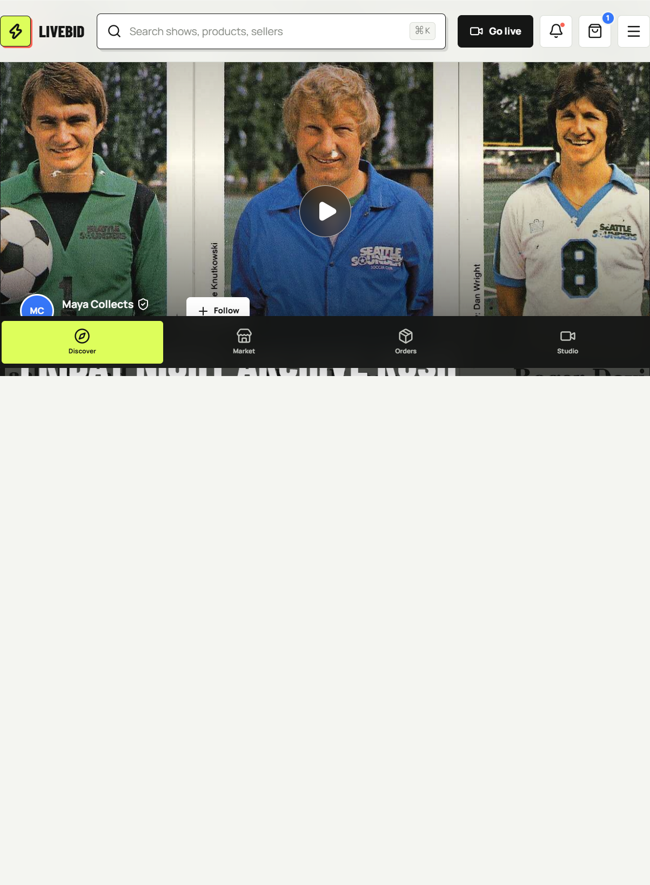
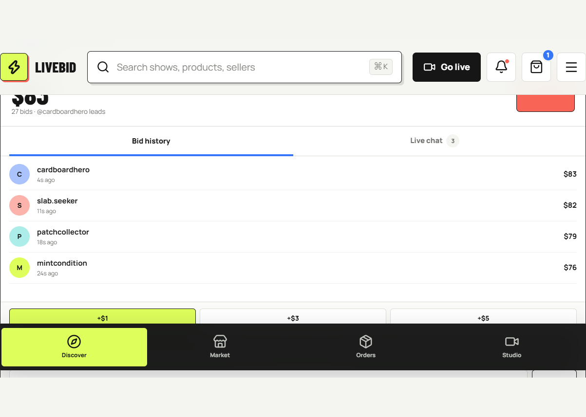
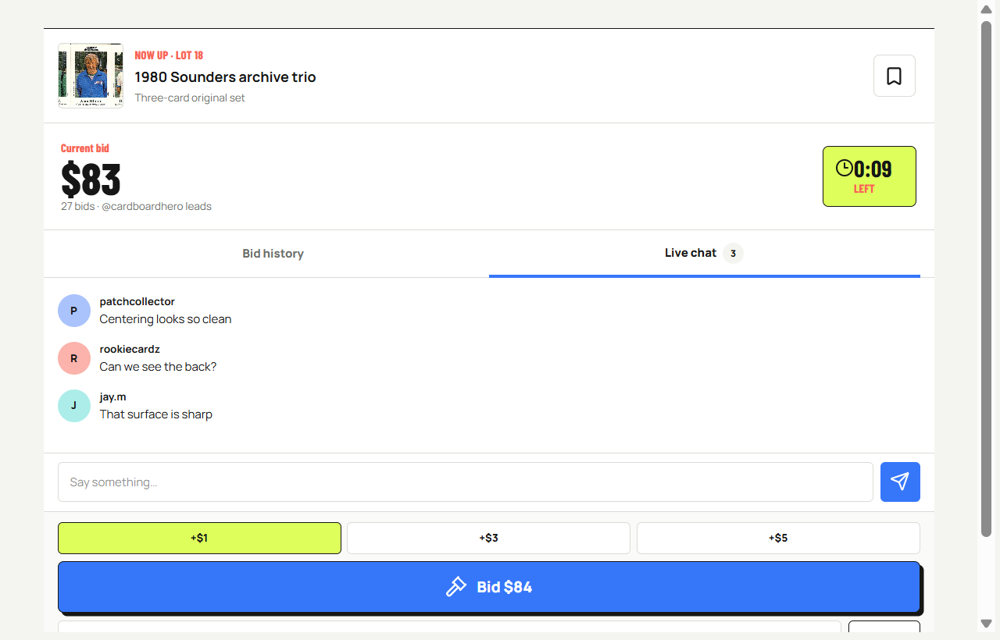
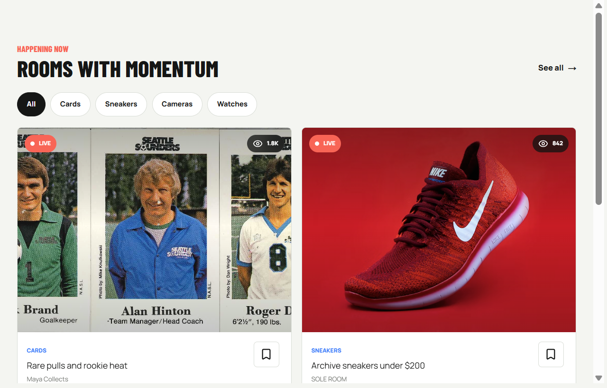
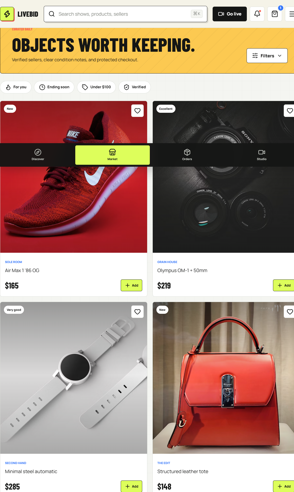
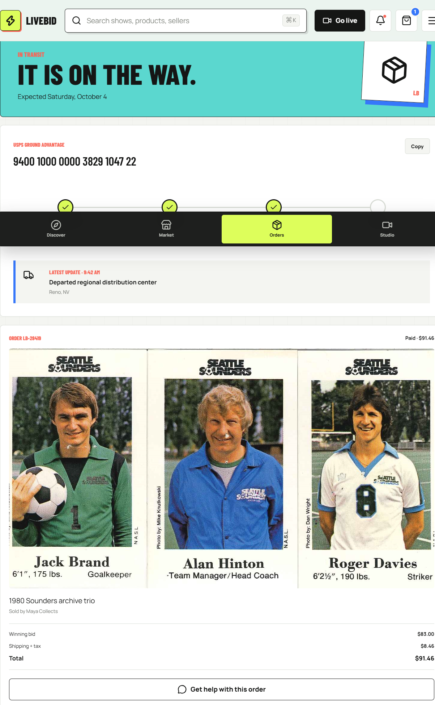
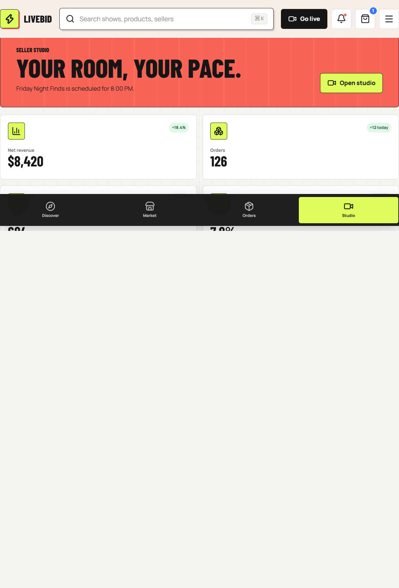
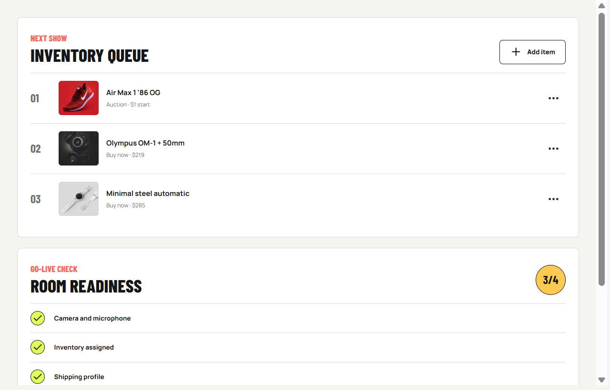

## Before you begin

LiveBid is an interactive live-commerce prototype for desktop and mobile
browsers. You can explore a live auction, shop a sample marketplace, review an
order, and open a seller dashboard.

> [!IMPORTANT]
> The prototype does not create accounts, charge payment methods, reserve
> inventory, stream video, or save data. All interactions stay in the current
> browser tab and reset when you reload the page.

Open the application using one of these addresses:

* Source development server: <http://localhost:3000>
* Default Docker Compose deployment: <http://localhost:3001>
* Public Vercel or container URL supplied by the deployer

See the [repository overview](../README.md) when you need to start the
application.

## Navigate LiveBid

The four main views are available in the left navigation rail on a wide screen
and the bottom navigation bar on a narrow screen.



| View       | What you can explore                                               |
|------------|--------------------------------------------------------------------|
| Discover   | Featured auction, bid history, live chat, shows, and reminders     |
| Market     | Product cards, condition details, saved items, and bag actions     |
| Orders     | Sample shipment progress, order details, and tracking information  |
| Studio     | Seller metrics, inventory queue, and go-live readiness             |

The header also contains search, a **Go live** shortcut, notifications, the
shopping bag, and a compact mobile menu. The search field filters show cards
on the Discover view by show title, seller, or category.

> [!NOTE]
> The displayed `Command+K` hint is visual in this release. Select the search
> field directly to enter a query.

## Explore the featured auction

The Discover view keeps the stream, current lot, price, countdown, bid history,
and bid controls visible in one workspace.



1. Open **Discover**.
2. Review the current lot, price, leading bidder, bid count, and countdown.
3. Select **Bid history** to see recent bids.
4. Select **Live chat** to read or send sample messages.
5. Select **Follow** beside Maya Collects to toggle the following state.
6. Select the bookmark on a show card to toggle its reminder.

The featured stream image and its playback controls are presentation elements.
They do not connect to a live video provider.

## Place a sample bid

1. Open **Discover** before the countdown reaches zero.
2. Choose a bid increment of **+$1**, **+$3**, or **+$5**.
3. Confirm the amount shown on the primary bid button.
4. Select **Bid**.
5. Check the confirmation message and the new entry at the top of the bid
   history.

An accepted sample bid updates the displayed price, identifies you as the
leader, and increases the bid count. If five seconds or less remain, the local
countdown returns to five seconds to demonstrate anti-sniping behavior.

When the countdown reaches zero, the bid button changes to **Auction ended**.
Reload the page to reset the demonstration.

> [!WARNING]
> Bid acceptance is simulated in the browser. It is not synchronized with
> other users and must not be treated as a purchase or binding offer.

## Set a private maximum

1. Find **Max bid** below the primary bid button.
2. Enter a whole-dollar amount.
3. Select **Set max**.
4. Confirm that the private maximum indicator shows the saved amount.

The amount must be at least the next displayed bid. This release stores the
value only in local React state. It does not automatically bid on your behalf.

## Participate in sample chat



1. Open **Discover**.
2. Select **Live chat** in the auction panel.
3. Enter a message of up to 180 characters.
4. Select the send button.

Your message appears at the bottom of the local conversation as the user
`you`. Empty messages are ignored. Messages disappear when the page reloads.

## Find shows



Use either search or category filters to narrow the show grid:

1. Enter a show title, seller, or category in the header search field.
2. Select **All**, **Cards**, **Sneakers**, **Cameras**, or **Watches**.
3. Clear the search field or select **All** to restore the full list.

Search and category filters apply together. When no show matches both values,
LiveBid displays an empty state.

Select a show bookmark to save or remove its reminder. Select the play button
on a show card to display an opening confirmation. Additional show rooms are
not implemented in this release.

## Shop the sample market



1. Open **Market**.
2. Review each product's seller, condition, and price.
3. Select the heart icon to exercise the product save control.
4. Select **Add** on a product.
5. Confirm the notification and the increased bag count in the header.

Selecting the bag icon opens the Market view. A bag detail page, quantity
editor, checkout, inventory reservation, and payment flow are not implemented.
The category and filter controls are visual placeholders in this release.

## Review the sample order



1. Open **Orders**.
2. Review the expected delivery date and shipment progress.
3. Check the carrier, sample tracking number, latest scan, and order total.
4. Select **Copy** to exercise the tracking confirmation.

The displayed shipment, tracking number, dates, seller, and total are sample
content. **Copy** shows a confirmation but does not write to the system
clipboard. The order support button is also a presentation element.

## Explore the seller studio



1. Open **Studio**, or select **Go live** in the header.
2. Review the revenue, order, viewer, and conversion sample metrics.
3. Check the inventory queue for the next show.
4. Review the room-readiness checklist.
5. Select **Open studio** to display the camera-preview confirmation.

The studio does not access your camera or microphone, modify inventory, or
start a stream. Queue controls and checklist rows demonstrate the intended
seller experience without backend behavior.



## Use notifications and the mobile menu

Select the bell in the header to open two sample notifications:

* The order notification opens the Orders view
* The live-show notification switches the auction panel to bid history

On smaller screens, select the menu icon to view **Profile**, **Saved**, and
**Bag** entries. These entries display the planned navigation structure but do
not open dedicated pages in this release.

## Reset the demonstration

Reload the browser page to restore:

* The original auction price, timer, leader, and bid history
* The initial chat messages
* Follow and reminder states
* The initial bag count
* The default Discover view

No sign-out or data-deletion step is necessary because the prototype does not
persist user data.

## Troubleshoot the experience

### The auction already ended

Reload the page. The sample countdown begins again from its initial value.

### Product images do not appear

Confirm that the browser can access remote images from Unsplash. The featured
card image is served locally from the application.

### Search returns no rooms

Clear the header search field and select **All** in the category strip.

### The application does not load

Check the health endpoint:

```powershell
Invoke-RestMethod http://localhost:3000/api/health
```

For the default Docker Compose deployment, use port `3001`:

```powershell
Invoke-RestMethod http://localhost:3001/api/health
```

If the health endpoint fails, follow the troubleshooting steps in the
[deployment guide](deployment.md).

## Related guides

* Use the [administrator guide](admin-guide.md) for privileged operations
* Review the [architecture guide](architecture.md) for implemented and planned
  system boundaries
* Review the [technical design](technical-design.md) for proposed backend,
  data, API, and reliability contracts
* Follow the [deployment guide](deployment.md) to publish or operate LiveBid
* Return to the [repository overview](../README.md) for prerequisites,
  validation, and container commands
